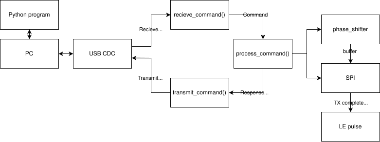

# Interface for MAPS-010144 digital phase shifter

## Description

STM32G0B01 based board for controlling daisy-chained digital phase shifter via SPI-like serial interface. User can interface with the board either by buttons and LEDs on the board or via virtual serial port over USB, communication over serial port is realized using simple TLV protocol.

### Repository contents
- [Kicad](Kicad) - ECAD projects of all desinged PCBs for the project
- [python_api](python_api) - Simple python api for communicating with the controller via serial port
- [Src](Src) - Firmware source code separated from generated STM32 project
- [phase_shifter_measurements](phase_shifter_measurements) - Measuremented scattering parameters of the phase shifter

### Serial communication

Available commands:
| **T**ype | **L**ength [bytes] | **V**alue             | Description |
|----------|--------------------|-----------------------|-------------|
| 0x00     | 8                  | any data              | Ping        |
| 0x01     | 8                  | copied from Ping      | Pong        |
| 0x02     | 1                  | command id            | Ack         |
| 0x10     | 4                  | phase shifts (0 - 15) | Set phase   |
| 0x11     | 0                  | -                     | Transmit    |
| 0x12     | 1                  | latch state           | Latch state |

Example routine to set new phase delay:
1. `0x12 0x01 0x00` - make sure that latch is set low in order to accept data via serial interface
1. `0x10 0x04 0x04 0x02 0x0f 0x08` - send phase shifts to the controller
1. `0x11 0x00` - transmit phase shifts via SPI to the phase shifters
1. `0x12 0x01 0x01` - set latch to update phase shift 
1. `0x12 0x01 0x00` - reset latch

### Buttons and LEDs

The board is equiped in 3 tactile buttons and two 4-led displays where each display shows according to the silkscreen description either currently selected phase shifter or phase shift set for the selected phase shifter.
Buttons have following functions starting from the left most button:
- On short press transmits current phase shifter configuration over SPI
- On short press cycles through 4 phase shifters, on long press sets all phase shifters to 0
- On short press increments phase delay, on long press set current phase shifter to 0

<!-- # MAPS-010144 Phase Shifter Interface as Part of Phased Antenna Array

## Description

A microcontroller serves as an interface for phase control, managing multiple phase shifters connected in a daisy chain via SPI. Bidirectional communication between the PC and MCU is established via UART/USB.

## Goals

in **bold** features in scope of SKM project

- **Serial interface with IC via SPI peripheral**
- **PC-MCU communication by UART/USB (virtual COM)**
- **Controlling multiple phase shifter in daisy chain**
- Python API for controlling beam direction
- I2C bus for communication with multiple arrays where one becomes master

## Block diagram

## Docs

- [Specification](./docs/Specification.md)
- [Report](./docs/SKM_Report_Kamil_Chaj.pdf) -->
