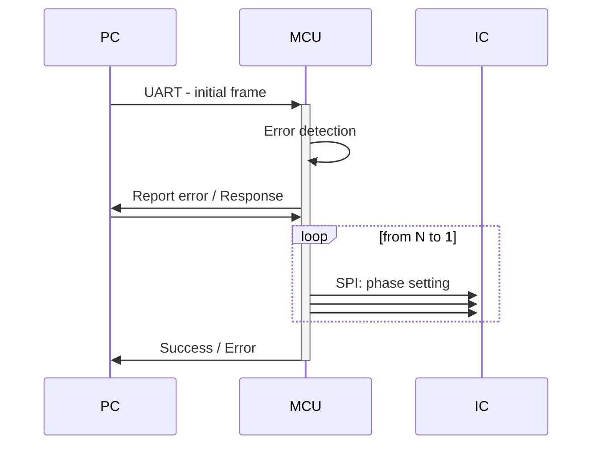
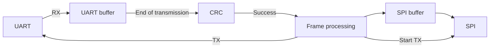

# Specification

## Communication sequence

## System diagram

## SPI

Serial communication specification according to MAPS-010144 datasheet[^2]

|Pin|Description|
|---------|---------|
|SERIN|MOSI|
|SEROUT|MSIO - connected to the next IC|
|CLK|Clock|
|LE|Output (phase) stays constant when set LOW|
|P/S|Parallel/Serial select, HIGH for Serial|

Internal register of the IC has 6 bits, where most significant bit represent most significant phase shift

|Option|Value|
|---------|---------|
|Data size|6 Bits|
|Frist bit|MSB first|
|Clock period|> 100ns|
|CPOL|LOW|
|CPHA|LOW|

## UART / USB

### Frame

Full frame is built of multiple bytes where:

|Bytes |Function|
|---------|---------|
|Byte 1|Command ID|
|Byte 2|Payload size|
|Byte 3|Data 0|
|Byte 4|Data 1|
|Byte ...|...|
|Byte N|Data N|
|Byte N + 1|CRC|

### Commands

#### Send phase shift buffer

- Data n - phase shifter address
- Data n+1 - phase shift

#### Request phase shift buffer

- Data n - phase shifter address

#### Load phase shift buffer

- No data

#### Clear phase shift buffer

- No data

#### Error

- Data n - contains error code
